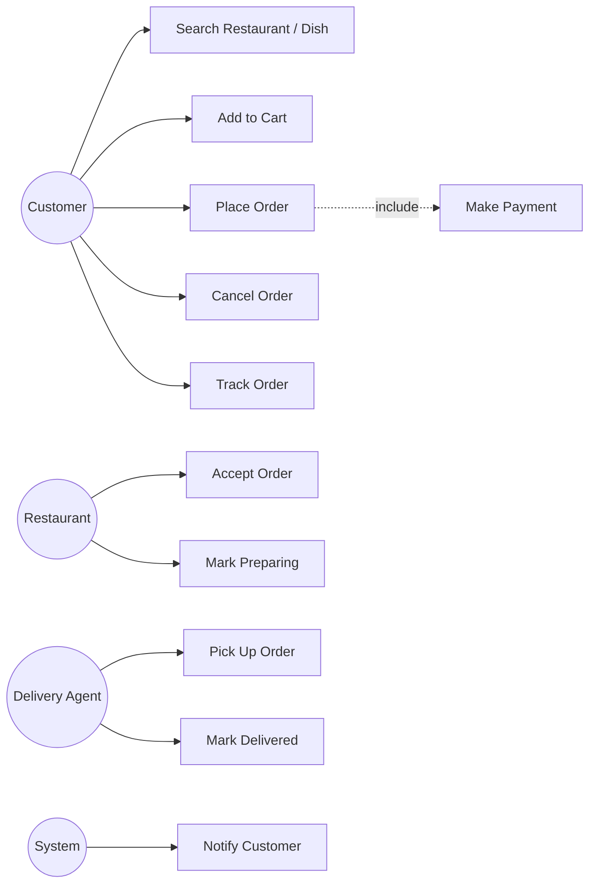
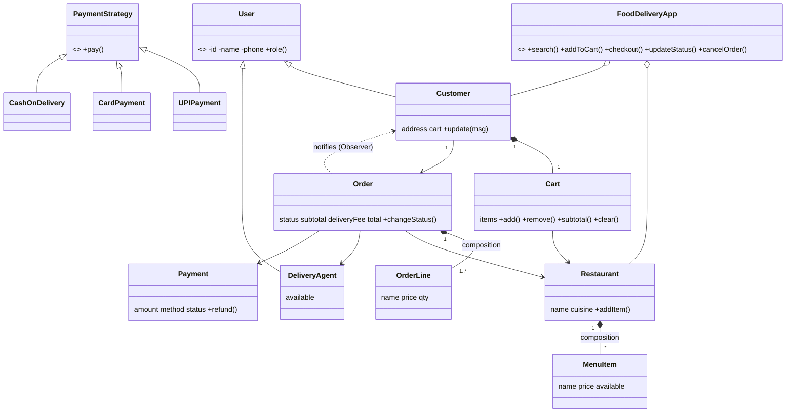
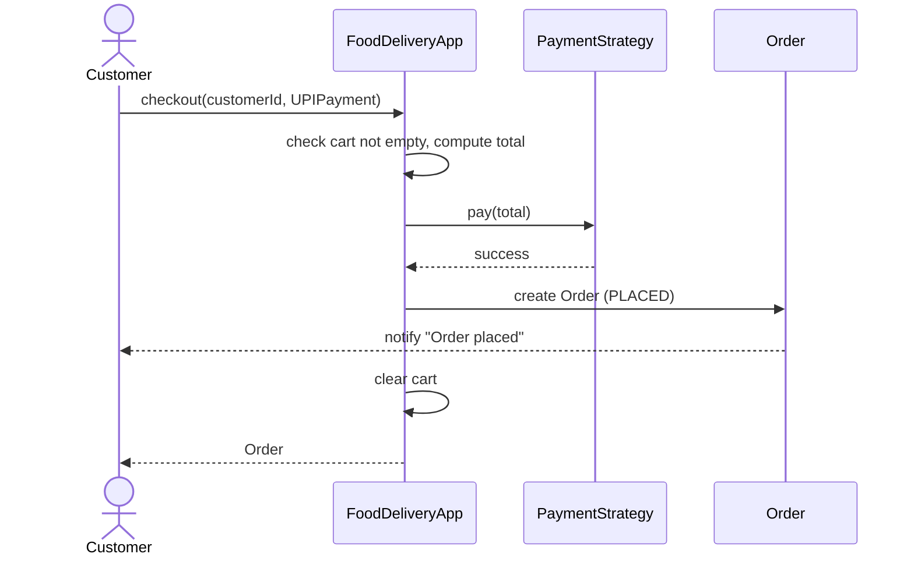
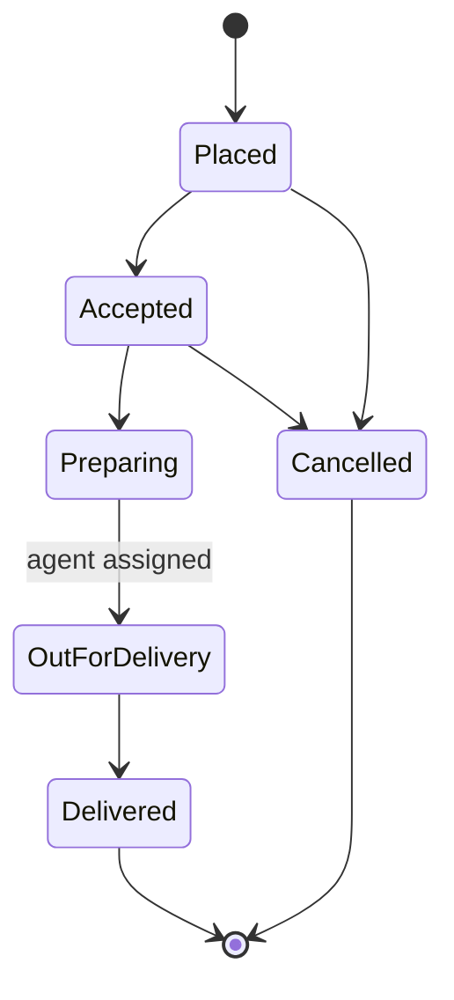

# Food Delivery System (OOAD)

Run: `python3 main.py` (demo) and `python3 -m unittest -v` (15 tests). Python 3.9+, no dependencies.

## 1. Requirements
- Customer: search restaurants or dishes, fill a cart, pay, track order, cancel
- Restaurant: manage menu, accept order, prepare food
- Delivery agent: picks up and delivers order
- Rules: one restaurant per cart; delivery fee Rs 30, free for orders of Rs 500 or more;
  cancel only before preparing starts (prepaid orders are refunded); COD is paid on delivery

## 2. Use case diagram

## 3. Class diagram

## 4. Sequence diagram: Place Order

## 5. State diagram: Order lifecycle

## 6. OOP concepts and patterns
| Concept | Where |
|---|---|
| Abstraction | `User`, `PaymentStrategy` are abstract |
| Inheritance | `Customer`, `DeliveryAgent` extend `User` |
| Encapsulation | private `_id`, `_upi_id`, `_card_no` |
| Polymorphism | `pay()` behaves differently for UPI, Card and COD |
| Composition | `Restaurant` owns `MenuItem`s, `Order` owns `OrderLine`s |
| Singleton | `FoodDeliveryApp.get_instance()` |
| Strategy | `UPIPayment`, `CardPayment`, `CashOnDelivery` |
| Observer | `Order` notifies the `Customer` on every status change |

## 7. Files
`models.py` domain classes and order state rules, `payment.py` Strategy, `app.py` Singleton facade,
`exceptions.py`, `main.py` demo, `test_food.py` test cases.

## 8. Extension ideas
Coupon codes (another Strategy), ratings and reviews, restaurant-side accept or reject, SQLite storage, Flask UI.
